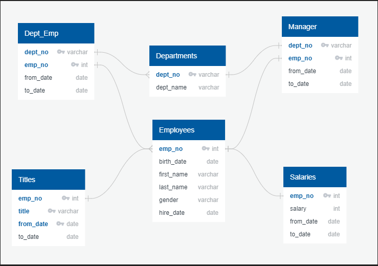
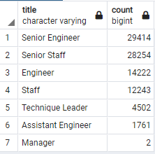
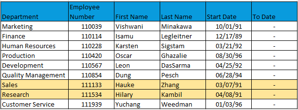
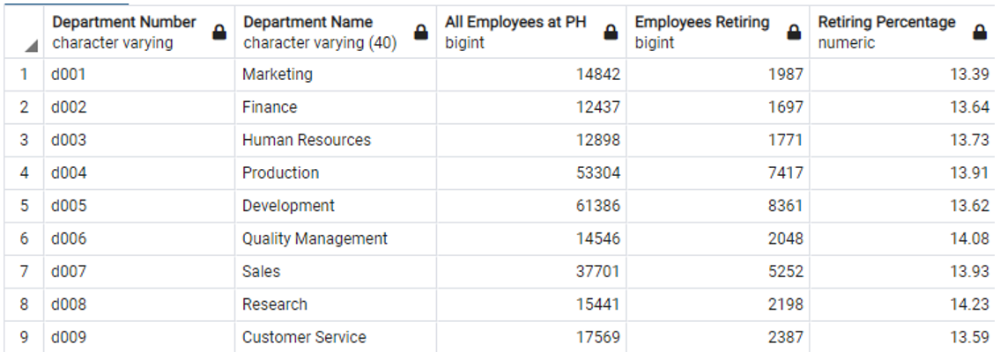
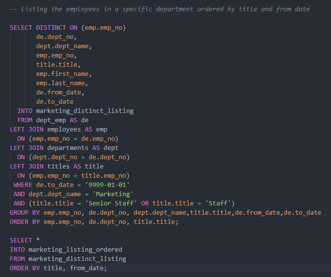
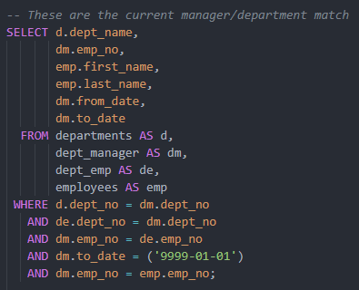
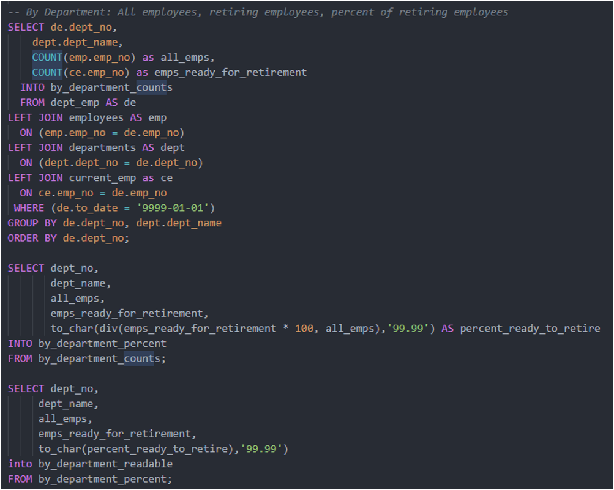

# Pewlett-Hackard-Analysis
Using Databases and SQL to help management find the employees needed to come up with a win-win opportunity 

##  Solving the Silver Tsunami 

### Overview:
It is time for Pewlett-Hackard’s management team to come up with a win-win situation for its’ employees. The opportunity is to find a way for retiring employees to help the next generation carry on successfully.

One of the management’s solutions is a mentoring program to help next generation of employes. Pewlett-Hackard’s has some very experienced and successful employees that might be willing to step into a part-time role instead of retiring completely to help cross-train some of the newer employees.

To do so, they need department and employee data researched. Here are the initial tables and the existing relationships between the tables:

### Results: 

#### Who will be retiring?
Below is a listing of the employee's title counts close to retirement age:

We even have two of our manager’s retiring. Who are they? 

Hauke and Hilary. 

During discovery, it came to be known that Hauke and Hilary are retiring as managers. One thing needing to be confirmed is whether or not these to individuals are the only two people on the management team starting out in other positions (other than management) at PEWLETT-HACKARD.  

#### Percent of Retirees:
The numbers in the other departments look staggering; however, the number of retirees across the board is between 13 and 14%.

#### Mentorship Program Results:
The criteria asked for by management for mentorship was to find all employees born in the year 1965 as criteria to be mentors. This resulted in finding 1,549 employees. Considering PEWLETT-HACKARD has 240,124 employees, I recommend finding more mentors. This is only .6% of all employees (less than a percent!) and only 5% of the total number of retirees. 

### Summary: 
#### Our Most Valuable Assets Are Our Employees (Promote from With-in)
If the two managers are the only managers promoted within the company, it will be highly recommended that at least two PEWLETT-HACKARD employees are groomed for management positions. Employees starting within a company have been known to be valuable assets to many successful companies.

#### Mentorship Program Results - What else can we do?
Asking why only employees whose birthdays were in 1965 were chosen might be a smart move. If mentors are needed, I would also suggest naming the employees who have: 

- Worked in more than one department
- Received the largest number of promotions
- Spent the most time at PEWLETT-HACKARD

If management likes these suggestions, I would create the queries.

For now, helping management identify employee's title and from_date seems more of a priority. A query has been created so each manager will have a tailored list of employees within their department. This list is order by title and length of time in the position. Here is an example of the query I could build each manager's employee information from.

Marketing’s listing:

### Other Queries: 

Using the below query, I was able to get the current management staff.

Using the below queries, I was able to get the percentages of retirees.

Here is a query for each department's titles.

### Table Confirmations:

#### emp_info: 
The dept_manager table does have a manager for each department. It was found that the emp_info table couldn't be used as a cross reference to manager's information. Managers are not necessarily entered into the system as an employee. It seems they may have only been entered into the emp_info table if they had started out in other positions. Managers, however, were entered into the employees’ table and in all department tables. I need to further check with management, though. They may understand more of the history behind the origination and use of these six tables.
